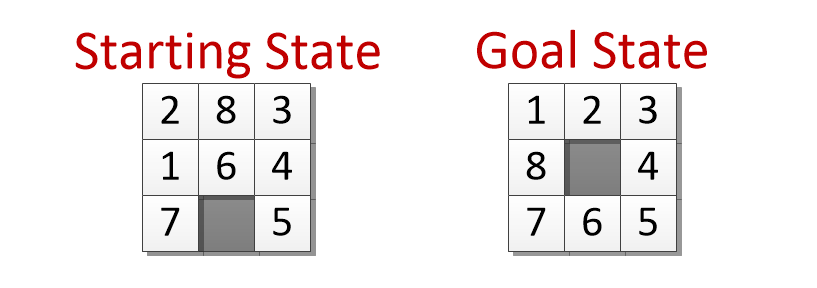
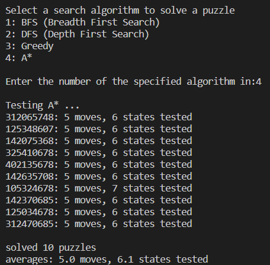

# Eight-Puzzle

This is a classic Eight Puzzle game that has been designed to test the efficiency of each search algorithms in solving each given eight puzzles written in a 9 digit string from a given _moves text file. The goal of this project was to see which search algorithm was the most efficient to solve the puzzles as the number of moves increases meaning an increase number of moves to perform in order to reach the goal state. You can view the `results.txt` to see the efficiency of each algorithm used to solve a given number of moves to solve for each eight puzzle text file.

# Test it out!

Feel free to test out the code and see what results you can get!

## To start, run this line on your terminal:

`python script.py`

It will prompt you to selecting which algorithm to test. Feel free to change the parameters ex: _moves/txt files to see how well each algorithm will perform given a different number of moves to solve.

## Here is a screenshot of the menu options and the output of selecting a algorithm option:

